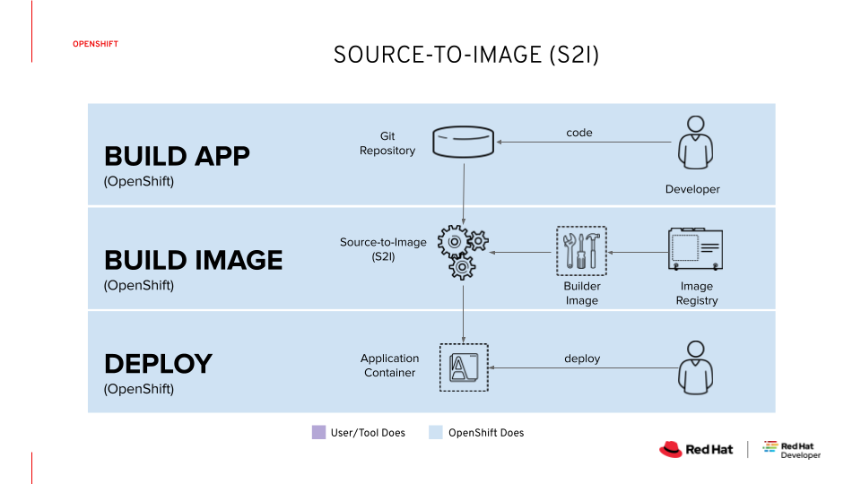

# 5-minute demo: OpenShift Builds
For more information, please see the [official product documentation](https://docs.openshift.com/container-platform/4.11/cicd/builds/understanding-image-builds.html).

## Table of Contents
- **[Introduction to OpenShift Builds](#introduction-to-openshift-builds)**<br>
- **[Set up a dev environment on OpenShift](#lets-set-things-up)**<br>
- **[Deploy a Hello World application from GitHub](#deploy-a-net-core-application-from-github)**<br>
- **[Deploy a Hello World application from local binary source](#building-application-from-binary-local-source)**<br>
- **[Triggering and modifying builds](#triggering-and-modifying-builds)**<br>
- **[Key takeaways](#key-takeaways)**<br>

---

## Introduction to OpenShift Builds
A build in OpenShift Container Platform is the process of transforming input parameters into a resulting object. Most often, builds are used to transform source code into a runnable container image.

### Source-to-image (S2I) build
The source-to-image strategy creates a new container image based on application source code or application binaries. Red Hat OpenShift clones the application source code, or copies the application binaries into a compatible builder image, and assembles a new container image that is ready for deployment on the platform.



---

## Let's set things up
OpenShift Builds are integrated part of the OpenShift Container Platform, and dont require any installation or configuration.
We only need to ensure that we have a connection to our OpenShift cluster and enough privileges to create a project (kubernetes namespace).

**Note:** If you dont have an OpenShift cluster available, you can use [OpenShift Developer Sandbox](https://developers.redhat.com/developer-sandbox).
The sandbox is perfect for immediate access into OpenShift. With the sandbox, you'll get free access to a shared OpenShift and Kubernetes cluster.

- Login to OpenShift cluster
```shell
oc login -u myuser -p mypassword
```
- Create a new OpenShift project
```shell
oc new-project s2i-demo
```
- Verify that the project is empty
```shell
oc get all
```
---

## Deploy a .NET Core application from GitHub

For this exercise, we'll use an existing dotnet Hello World application. The source code of this application is made available via GitHub [repo](https://github.com/adnan-drina/s2i-dotnetcore-ex.git).

With the ``new-app`` command we'll create application from source code in a remote Git repository.

The ``new-app`` command creates a build configuration, which itself creates a new application image from our source code. 
The ``new-app`` command typically also creates a Deployment object to deploy the new image, and a service to provide load-balanced access to the deployment running our image.

In addition, we'll have to expose our service by creating a route to access our application externally via a web browser.

- Let's create our app from the git repo
```shell
oc new-app --name=dotnet-demo 'dotnet:6.0-ubi8~https://github.com/redhat-developer/s2i-dotnetcore-ex#dotnet-6.0' \
--build-env DOTNET_STARTUP_PROJECT=app
```
- View the status of the app
```shell
oc status
```
- Make the application accessible externally
```shell
oc expose service dotnet-demo
```
- Access the service using the Route URL
```shell
ROUTE="http://$(oc get route s2i-dotnetcore-ex -o jsonpath="{.spec.host}")"
curl -s $ROUTE | grep Welcome
```
---

## Building application from binary (local) source
Streaming content from a local file system to the builder is called a Binary type build.

To demonstrate binary builds, we'll create a simple dotnet Hello World application and run ```dotnet publish``` command to prepare our application for deployment.

Then we'll log into our OpenShift cluster, create a project and create a new build object specifying a base image that best suits our application. Once created, we'll start our build by pointing it to our application project folder.

- #### Create a simple dotnet Hello World application

```shell
dotnet new web -o webapp &&\
cd webapp &&\
dotnet publish -c Release
```
After completion of ```dotnet publish``` command, a new folder should appear in our application directory /bin/Release/net6.0/publish.
With this, our dotnet Hello World application is ready for deployment to OpenShift.

- #### Login to OpenShift and create a project (kubernetes namespace).
```shell
oc login -u myuser -p mypassword
oc new-project my-dev-sandbox
```
With the dev project created, we can start preparing our application build resources.

- #### Create a new binary build.
```shell
oc new-build dotnet:6.0 --binary --name=mywebapp -l app=mywebapp
```

- #### Start the build by providing our application build artefacts.
```shell
oc start-build mywebapp --from-dir=./bin/Release/net6.0/publish --follow
```
After build completion, a newly created container image will be available for deployment. We can check our container images by describing image stream objects on OpenShift.
```shell
oc describe is mywebapp
```
With new container images in place, we can trigger the deployment of our application.

- #### Deploy application
```shell
oc new-app mywebapp
```
We'll also run the following command to expose our service to the world.
```shell
oc expose service/mywebapp 
```
Now everyone can access our app from the web using a route
```shell
oc get route mywebapp
```

With this, we have deployed our application from the local binary source. 

After every application ***code change***, 
we can simply compile our app using `dotnet publish -c Release` command 
and start a new-build by executing the `oc start-build mywebapp --from-dir=./bin/Release/net6.0/publish` command.

---

## Triggering and modifying builds
Now that we have our build process in place, let's see how we can modify and trigger new builds using webhooks.

#### Build Triggers
We can define different triggers in our BuildConfigs. With these triggers, we can instruct our builds to run based on specific events like a change in source code or a change in our base image.
For example, a new image tag was made available with important security fixes, and we want to rebuild all our applications to use this new patched base image. And we can do precisely that fully automated with the use of triggers.

- #### Let's try it out:

Our BuildConfig, by default, has preconfigured triggers on Config and ImageChange. 
We can check this by describing our BuildConfig.
For more information please see [official documentation](https://docs.openshift.com/container-platform/4.11/cicd/builds/triggering-builds-build-hooks.html)

- Let's switch to our s2i-demo project
```shell
oc project s2i-demo
```
- Now let's describe our BuildConfig and look for Triggers
```shell
oc describe bc dotnet-demo | grep Trigger
Triggered by:     Config, ImageChange
```
- In case triggers are missing, we can add them like this:
```shell
oc set triggers bc <name> --from-github
oc set triggers bc/dotnet-demo --from-image=openshift/dotnet:6.0-ubi8
```

- We'll use the ImageChange trigger for our example.

Now, we have to get more details on our ImageStream used by our BuildConfig.
If we describe our BuildConfig, we'll see that it relies on images from ImageStream named dotnet:6.0-ubi8 located in namespace openshift.

```shell
oc describe bc dotnet-demo | grep "From Image"
From Image:     ImageStreamTag dotnet:6.0-ubi8
```

- Now let's check this ImageStream in more detail by executing describe command.

```shell
oc describe istag/dotnet:6.0-ubi8 -n openshift | grep url
url=https://access.redhat.com/containers/#/registry.access.redhat.com/ubi8/dotnet-60/images/6.0-5.1645817052
```

From this, we see our ImageStream tag pointing to an image on access.redhat.com with tag 6.0-5.1645817052.

- Let's see on [access.redhat.com](https://catalog.redhat.com/software/containers/search?q=dotnet) if there is a new tag available.

And yes, the latest tag is 6.0-20.20221101100921.

So, now we can update our ImageStream tag with this new image tag and check if that change will trigger a new build and deployment of our application.

- Let's update our ImageStream tag.

```shell
oc tag registry.access.redhat.com/ubi8/dotnet-60@sha256:1d426a5b589710ae9ca64a19caef1d6349b5ffb712085b39808a9f3fae03af7a \
dotnet:6.0-ubi8 -n openshift
```

Now, a new build should have started if we check our builds and deployments.
By checking the status of the latest build, we should see that an image change triggered the build.

```shell
oc describe build dotnet-demo-2 | grep trigger
Build trigger cause:    Image change
```

With this integration we have a very elegant way of maintaining our base images and ensuring all applications have the latest security-patched images.

---

## Key takeaways
The main advantage of using S2I for building reproducible container images is the ease of use for developers.
### Goals

- #### Reproducibility
Allow build environments to be tightly versioned by encapsulating them within a container image and defining a simple interface (injected source code) for callers. Reproducible builds are a key requirement to enabling security updates and continuous integration in containerized infrastructure, and builder images help ensure repeatability as well as the ability to swap runtimes.

- #### Flexibility
Any existing build system that can run on Linux can be run inside of a container, and each individual builder can also be part of a larger pipeline. In addition, the scripts that process the application source code can be injected into the builder image, allowing authors to adapt existing images to enable source handling.

- #### Speed
Instead of building multiple layers in a single Dockerfile, S2I encourages authors to represent an application in a single image layer. This saves time during creation and deployment, and allows for better control over the output of the final image.

- #### Security
Dockerfiles are run without many of the normal operational controls of containers, usually running as root and having access to the container network. S2I can be used to control what permissions and privileges are available to the builder image since the build is launched in a single container. In concert with platforms like OpenShift, source-to-image can enable admins to tightly control what privileges developers have at build time.

---

## Clean things up
```shell
oc delete all -l app=s2i-dotnetcore-ex -n s2i-demo
oc delete project s2i-demo

oc delete all -l app=mywebapp -n my-dev-sandbox
oc delete project my-dev-sandbox
```
