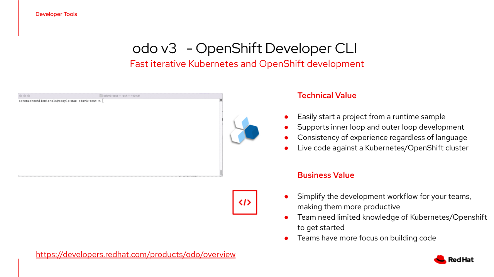
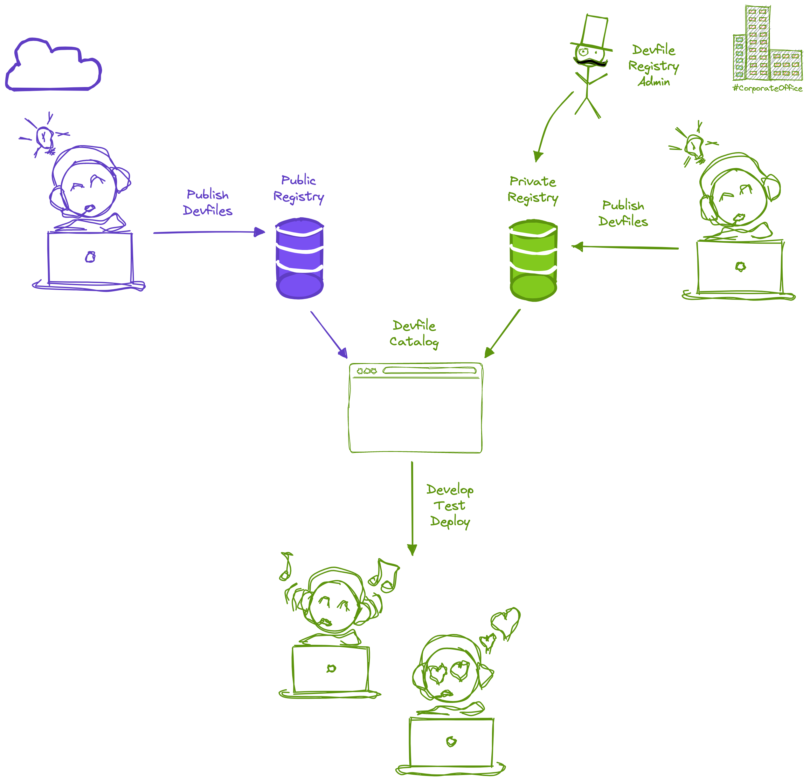

# 5-minute demo: odo - Developer-focused CLI for fast & iterative application development on Kubernetes
For more information, please see the [official product documentation](https://access.redhat.com/documentation/en-us/openshift_container_platform/4.11/html/cli_tools/developer-cli-odo) or have a look at the [community documentation](https://odo.dev/docs/introduction).

## Table of Contents
- **[Introduction to odo](#introduction-to-odo)**<br>
- **[Set up a dev environment on OpenShift](#lets-set-things-up)**<br>
- **[Initialize your odo workspace](#initializing-your-application)**<br>
- **[Developing Continuously with odo](#developing-your-application-continuously)**<br>
- **[Making application changes](#lets-make-some-code-changes)**<br>
- **[Key takeaways](#key-takeaways)**<br>
- **[Cleaning up](#clean-things-up)**<br>
---

## Introduction to odo
odo is a fast, and iterative CLI tool for developers who write, build, and deploy applications on Kubernetes and OpenShift.




### Why use odo?

* Fast: Spend less time maintaining your application deployment infrastructure and more time coding. Immediately have your application running each time you save.
* Standalone: odo is a standalone tool that communicates directly with the Kubernetes API. There is no requirement for a daemon or server process.
* No configuration needed: There is no need to dive into complex Kubernetes yaml configuration files. odo abstracts those concepts away and lets you focus on what matters most: code.
* Containers first: We provide first class support for both Kubernetes and OpenShift. Choose your favourite container orchestrator and develop your application.
* Easy to learn: Simple syntax and design centered around concepts familiar to developers, such as projects, applications, and components.

### Devfiles

One of the key building blocks used by odo is a devfile. A devfile provides a consistent developer runtime environment for containers (similar in concept to a base image with developer tools included) that can be distributed to teams via a devfile registry. This allows teams to pre-bake a good development environment for the language or framework that is used and define a standard way of working. This devfile can also include build and CI commands or deployment options.



For more information about devfiles, go to https://devfile.io

---

## Let's set things up

odo is one of the command line tools that is available to interact with kubernetes/OpenShift clusters. This can be downloaded via the web console or at the following [location](https://developers.redhat.com/content-gateway/rest/mirror/pub/openshift-v4/clients/odo/). Install this on your laptop and make sure it is available on your path.

This example uses dotnet 6.0, this can be downloaded at this [location](https://dotnet.microsoft.com/en-us/download/dotnet/6.0). Make sure the dotnet cli client is available on your path.

This demo also assumes you have a git client available on your machine.

Now that the cli tools are available on your machine, let's create an example application.

---

## Create a simple dotnet Hello World application

In this case, we will generate a simple MVC application that we can use in our example. 

>**WARNING**: odo is a opinionated tool and assumes your application is named "app" 

```shell
dotnet new mvc --name app
cd app
```

We can also initialize our local git repo and commit our initial app:

```shell
git init
git add .
git commit -m "initial commit"
```


## Login to OpenShift Cluster
The easiest way to connect odo to an OpenShift cluster is use copy "Copy login command" function in OpenShift Web Console.

**Note:** If you dont have an OpenShift cluster available, you can use [OpenShift Developer Sandbox](https://developers.redhat.com/developer-sandbox).
The sandbox is perfect for immediate access into OpenShift. With the sandbox, you'll get free access to a shared OpenShift and Kubernetes cluster.

* Login to OpenShift Web Console.
* At the top right corner click on your username and then on "Copy login command".
* You will be prompted to enter your login credentials again.
* After login, open "Display Token" link.
* Copy whole oc login --token ... command and paste it into the terminal, before executing the command replace oc with odo.


## Create a new project
If you are using OpenShift, you can create a new namespace with the odo create project command. This provides a working space on your cluster to deploy your application.

```shell
$ odo create project odo-dev
 ✓  Project "odo-dev" is ready for use
 ✓  New project created and now using namespace: odo-dev
 ```

---

## Initializing your application

Now we'll initialize your application by creating a devfile.yaml to be deployed. A devfile defines a common developer stack that is used during the development lifecycle.

odo handles this automatically with the odo init command by autodetecting your source code and downloading the appropriate Devfile.

Note: If you skipped generating a new application previously, select a "starter project" when running odo init.

Let's run odo init and select .NET:

```shell
$ odo init
  __
 /  \__     Initializing new component
 \__/  \    Files: Source code detected, a Devfile will be determined based upon source code autodetection
 /  \__/    odo version: v3.0.0~beta3
 \__/


Interactive mode enabled, please answer the following questions:
Based on the files in the current directory odo detected
Language: dotnet
Project type: dotnet
The devfile "nodejs" from the registry "DefaultDevfileRegistry" will be downloaded.
? Is this correct? Yes
 ✓  Downloading devfile "dotnet" from registry "DefaultDevfileRegistry" [501ms]
Current component configuration:
Container "runtime":
  Opened ports:
   - 8080
  Environment variables:
? Select container for which you want to change configuration? NONE - configuration is correct
? Enter component name: my-dotnet-app


Your new component 'my-dotnet-app' is ready in the current directory.
To start editing your component, use 'odo dev' and open this folder in your favorite IDE.
Changes will be directly reflected on the cluster.
 ```


>**NOTE**: Alternatively you can also specify some options directly using commandline flags:
>
>```shell
>odo init --devfile dotnet60 --name=my-dotnet-app
>```
><br>
<br>
A devfile.yaml has now been added to your directory and now you're ready to start development.

With this you have seen how easy it is to get started with your framework/language of choice. From a developer perspective we can get started with minimal kubernetes knowledge.

---

## Developing your application continuously

Now that we've generated our code as well as our Devfile, let's start on development.

odo uses inner loop development and allows you to code, build, run and test the application in a continuous workflow.

Once you run odo dev, you can freely edit code in your favourite IDE and watch as odo rebuilds and redeploys it.

Let's run odo dev to start development on your .NET application:

```shell
odo dev
  __
 /  \__     Developing using the my-dotnet-app Devfile
 \__/  \    Namespace: default
 /  \__/    odo version: v3.0.0~beta3
 \__/


↪ Deploying to the cluster in developer mode
 ✓  Waiting for Kubernetes resources [3s]
 ✓  Syncing files into the container [330ms]
 ✓  Building your application in container on cluster [4s]
 ✓  Executing the application [1s]


Your application is now running on the cluster
 - Forwarding from 127.0.0.1:40001 -> 8080


Watching for changes in the current directory /Users/user/dotnet
Press Ctrl+c to exit `odo dev` and delete resources from the cluster
 ```

You can now access the application at http://localhost:40001 in your local browser and start your development loop. odo will watch for changes and push the code for real-time updates.

With this we are able to constantly deploy our changes to a kubernetes/OpenShift cluster to test our application, without having to define kubernetes objects and also without having to run multiple containers on your laptop or even having to think of containers yet.

---

## Let's make some code changes

In the following section we will make some code changes and get a feel for the development flow using odo.

Create a new git branch

```shell
git branch my-branch
git checkout my-branch
```

Let's modify one of our source files, to see how live coding works:

Open /app/Views/Home/Index.cshtml in your favourite editor
Edit the Welcome Message:  "Welcome to my app!"
Save

You will see that odo automatically rebuilds your application and deploys it to your connected cluster.

Refresh your browser at http://localhost:40001 and see your new welcome message

Now let's commit our changes in our branch:

```shell
git add /app/Views/Home/Index.cshtml
git commit -m "Updated welcome message"
```
As you can see from a developer perspective, I am able to focus on my code and version control process as I would normally do.

Say I want to switch back to the main branch, what would happen?

Open another terminal window and checkout your main branch (remember we haven't made code changes to this branch)

```shell
git checkout main
```

The deployment is automatically updated once again by odo and your main branch code is deployed.

Refresh your browser at http://localhost:40001 and see your old welcome message


As you could see odo fits in easily into your existing source code management strategy and allows you to deploy different code branches to your test cluster.

 ## Key takeaways

odo provides an alternative approach to development for kubernetes/OpenShift allowing the following:

* Ability to focus on coding while hiding the complexity of kubernetes
* Ability to test your application using continuous deployment towards a cluster
* Easy integration into existing workflows
* Increased developer onboarding rate and productivity

 ## Clean things up

In order to clean up your deployment on your cluster, enter ctrl-c into the terminal where odo dev is running. This will cleanup all the deployed artifacts on the cluster in your namespace.

Optionally you can also delete your namespace

```shell
oc delete project odo-dev
```