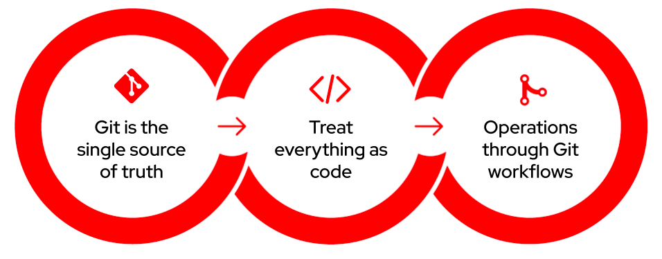
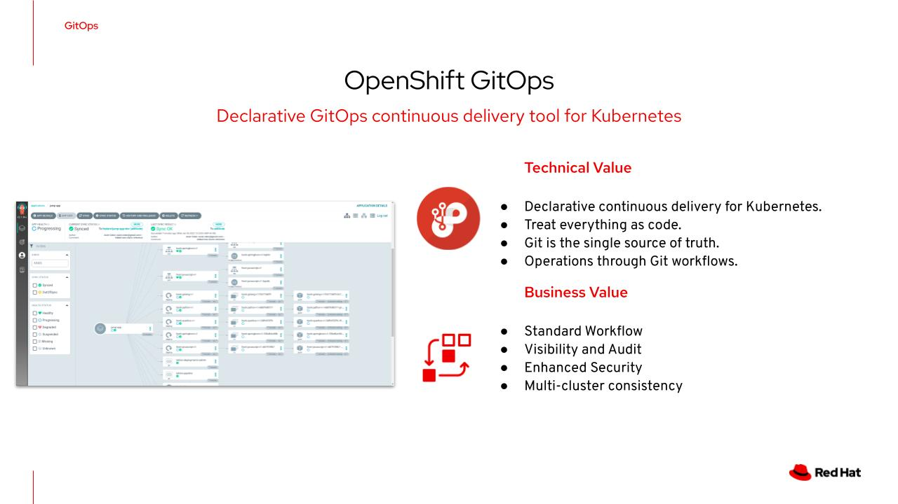
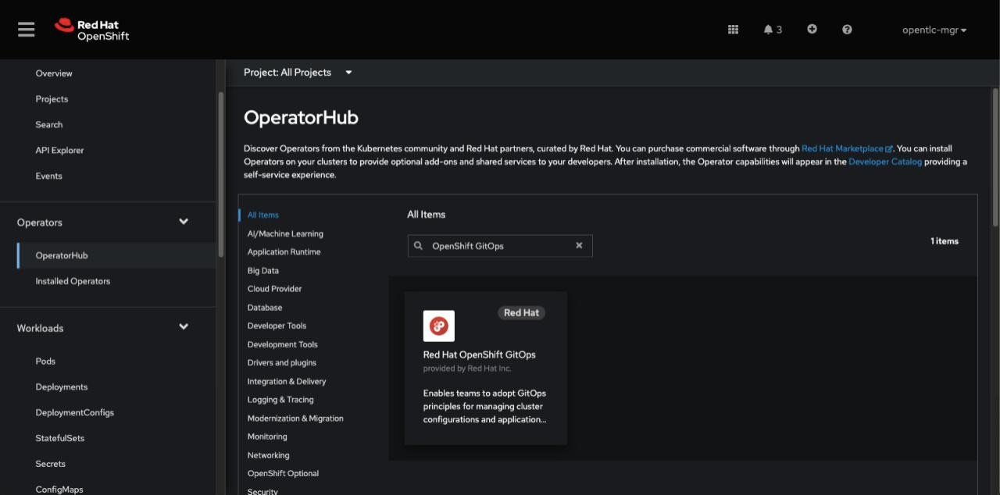
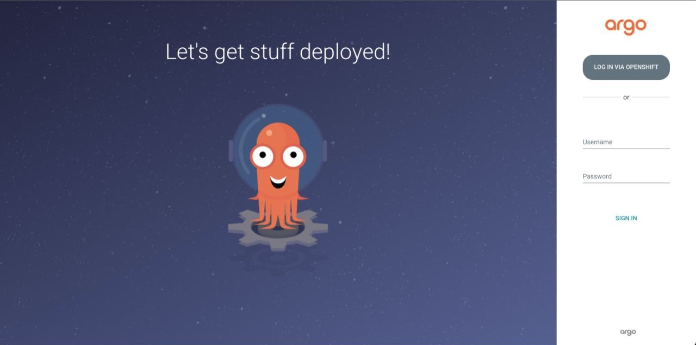
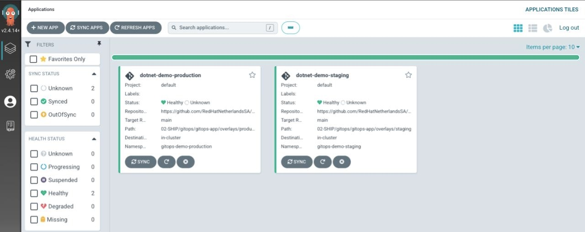
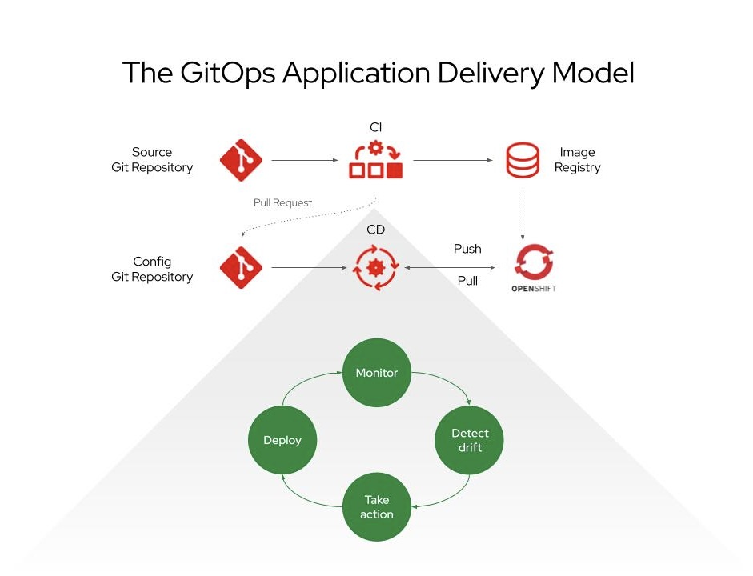

# 5-minute demo: OpenShift GitOps
For more information, please see the [official product documentation](https://docs.openshift.com/container-platform/4.11/cicd/gitops/understanding-openshift-gitops.html).

## Table of Contents
- **[What is GitOps?](#what-is-gitops)**<br>
- **[Introduction to OpenShift GitOps](#introduction-to-openshift-gitops)**<br>
- **[Installing OpenShift GitOps](#installing-the-openshift-gitops-argo-cd-operator)**<br>
- **[Deploying a demo application](#deploying-a-demo-application)**<br>
- **[Adopting GitOps practices](#adopting-gitops-practices)**<br>
- **[Releasing applications with ArgoCD](#releasing-applications-with-argocd)**<br>
- **[Key takeaways](#key-takeaways)**<br>

---
# What is GitOps?
GitOps is an approach to continuous delivery (CD) and treats Git as the single source of truth for everything, including infrastructure, platform, and application configurations. 
Teams can then take advantage of Git workflows to drive cluster operations and application delivery to enable predictable, more secure, and repeatable changes to clusters. 
At the same time, observability and visibility of the actual state are increased, and possible configuration drifts can be detected easily and immediately through the GitOps workflow. 
GitOps allows for maintaining full transparency through Git audit capabilities and provides a straightforward mechanism to roll back to any desired version across multiple OpenShift and Kubernetes clusters.



# Introduction to OpenShift GitOps

OpenShift GitOps is built around open-source project Argo CD as the declarative GitOps engine that enables GitOps workflows across multicluster OpenShift and Kubernetes infrastructure. 
- Using Argo CD, teams can sync the state of OpenShift and Kubernetes clusters and applications with the content of the  Git repositories manually or automatically. 
- Argo CD continuously compares the state of the clusters and the Git repositories to identify any drift and can automatically bring the cluster back to the desired state if any change is detected on the Git repository or the cluster. 
- The auto-healing capabilities in Argo CD increase the security of the CD workflow by preventing undesired, unauthorized, or unvetted changes that might be performed directly on the cluster unintentionally or through security breaches.



---

# Installing the OpenShift GitOps (Argo CD) operator

Since it’s supported by an Operator, OpenShift GitOps is very easy to install and upgrade.

1. Open the Administrator perspective of the web console and navigate to Operators → OperatorHub in the menu on the left.
2. Search for OpenShift GitOps, click the Red Hat OpenShift GitOps tile, and then click Install.

Red Hat OpenShift GitOps will be installed in all namespaces of the cluster.



Note: If you dont want to use OpenShift Console GUI for installing Pipelines Operator, you can use [Red Hat COP GitOps Catalog](https://github.com/redhat-cop/gitops-catalog/tree/main/openshift-gitops-operator)

```shell
oc apply -k https://github.com/redhat-cop/gitops-catalog/openshift-gitops-operator/overlays/latest
```
The result should be similar to this:
```shell
subscription.operators.coreos.com/openshift-gitops-operator created
```

After the installation is complete, ensure that all the pods in the openshift-gitops namespace are running:
```shell
oc get pods -n openshift-gitops
```
The result should be similar to this:
```shell
NAME                                                          READY   STATUS    RESTARTS   AGE
cluster-7f59b69c56-rgpgb                                      1/1     Running   0          2m1s
kam-7694bd6c85-lngm7                                          1/1     Running   0          2m1s
openshift-gitops-application-controller-0                     1/1     Running   0          119s
openshift-gitops-applicationset-controller-69d7b598d5-mcnml   1/1     Running   0          119s
openshift-gitops-dex-server-b744ff94-x8q7m                    1/1     Running   0          2m
openshift-gitops-redis-794f4dbb9f-8mnmt                       1/1     Running   0          119s
openshift-gitops-repo-server-67bd56c86d-fdq4z                 1/1     Running   0          119s
openshift-gitops-server-699f794bb5-8qp2p                      1/1     Running   0          119s
```
With this, we have installed OpenShift GitOps, which as a result, creates a ready-to-use Argo CD instance that is available in the openshift-gitops namespace.

## Login to Argo CD instance

Now, let's access our ready-to-use Argo CD instance using the `openshift-gitops-server` route in `openshift-gitops` namespace

Get ARGO Server URL from the route in openshift-gitops project:
```shell
ARGO="http://$(oc get -n openshift-gitops route openshift-gitops-server -o jsonpath="{.spec.host}")"
```
Open ARGO in your browser:
```shell
open -a "Google Chrome" $ARGO
```
We can also navigate to the OpenShift Console applications menu icon menu → OpenShift GitOps → Cluster Argo CD.

The login page of the Argo CD UI is displayed in a new window.



And we'll log in using our OpenShift credentials.

---

# Deploying a demo application

Here we'll create our application namespaces and deploy the .Net demo application using `oc new-app` from the source code hosted on GitHub.

## Let's set things up

- Login to OpenShift cluster
```shell
oc login -u myuser -p mypassword
```
- Create a new OpenShift project
```shell
oc new-project gitops-demo
```

## Deploy a .NET Core application from GitHub

For this exercise, we'll use an existing dotnet Hello World application. The source code of this application is made available via GitHub [repo](https://github.com/adnan-drina/s2i-dotnetcore-ex.git).

With the ``new-app`` command we'll create application from source code in a remote Git repository.

The ``new-app`` command creates a build configuration, which itself creates a new application image from our source code.
The ``new-app`` command typically also creates a Deployment object to deploy the new image, and a service to provide load-balanced access to the deployment running our image.

In addition, we'll have to expose our service by creating a route to access our application externally via a web browser.

- deploy the app
```shell
oc new-app --name=dotnet-demo 'dotnet:6.0-ubi8~https://github.com/redhat-developer/s2i-dotnetcore-ex#dotnet-6.0' \
--build-env DOTNET_STARTUP_PROJECT=app
```
Kubernetes' resources created:
```shell
...
--> Creating resources ...
    imagestream.image.openshift.io "dotnet-demo" created
    buildconfig.build.openshift.io "dotnet-demo" created
    deployment.apps "dotnet-demo" created
    service "dotnet-demo" created
...
```

- View the status of the app
```shell
oc status
```
- Make the application accessible externally
```shell
oc expose service dotnet-demo
```

- Access the service using the Route URL
```shell
ROUTE="http://$(oc get route dotnet-demo -o jsonpath="{.spec.host}")" &&\
curl -s $ROUTE | grep Welcome
```
The result should be similar to this:
```shell
curl -s $ROUTE | grep Welcome
    <h1 class="display-4">Welcome</h1>
```
You can also view the app in your browser
```shell
open -a "Google Chrome" $ROUTE
```
---

# Adopting GitOps practices

We'll start adopting our GitOps practices by exporting and cleaning our Kubernetes application resources such as Deployments, Services, and Routes and placing them in our newly created gitops configuration repository.

We'll also introduce Kustomize, a built-in templating engine, and we'll create templates for our application deployment to staging and production environments.

## Export YAMLs from our deployed demo app

In the previous steps, for our application deployment, we have used the `oc new-app` command that has "magically" created all Kubernetes resources such as Deployment, Service, etc.

Now, our first step in adopting GitOps practice will be to:
- export all application configurations (YAML files) from our OpenShift cluster,
- clear these files from unwanted metadata and 
- store them in application gitops repository.

We can export all resources using `oc get all` command, like this:
```shell
oc get all -l app=dotnet-demo -o yaml > ./tmp/dotnet-demo.yaml
```
Once exported, we can manually remove unwanted metadata from the YAML file.

To speed things up, we have created shell scripts that will automate exporting and cleaning of Deployment, Service and Route resources.
After the successful execution of the scripts, all files will be available in the ./tmp folder, and we can copy them to our application gitops git repository.

```shell
./02-SHIP/gitops/export/01-deployment-export.sh gitops-demo dotnet-demo ./tmp/ &&\
./02-SHIP/gitops/export/02-service-export.sh gitops-demo dotnet-demo ./tmp/ &&\
./02-SHIP/gitops/export/03-route-export.sh gitops-demo dotnet-demo ./tmp/ 
```

Note: There are also `kubectl` plugins available like [Krew](https://blog.ccavazos.co/posts/kubectl-krew-oc-neat) that focuses on making your YAMLs look like they used to before creating the resources in your cluster.

## Bootstrap a GitOps repository.

Now that we have our YAML files, we'll have to create and organize our GitOps repository structure, which will serve as a single source of truth for all further deployments to Kubernetes environments.

The question of best practices comes up a lot when creating repositories for GitOps. Unfortunately, there is no magic bullet, but several common patterns exist to match the various ways the organization interacts internally. You can read more about it in this [blog](https://developers.redhat.com/articles/2022/09/07/how-set-your-gitops-directory-structure#).

For our demo app, we'll create a straightforward gitops repository following the [Kustomize](https://kustomize.io/) model. Kustomize is Argo's built-in templating engine, and we'll use it to customize our application configuration before releasing it to other Kubernetes environments.

According to Kustomize we'll separate our application configuration sets into two types, base and overlays.
- **Base** holds all common configuration resources.
- **Overlays** keep differences from a specific environment.

```
gitops-app
├── base
└── overlays
  ├── production
  └── staging
```

### Kustomization file

Each directory contains a kustomization file, which is essentially a list of resources or manifests that describes how to generate or transform Kubernetes objects.

- #### base/kustomization.yaml

In our base directory, we'll create a kustomization.yaml file declaring all application resources.
```shell
resources:
- deployment.yaml
- service.yaml
- route.yaml
```
The other resources in this directory are exports from our demo application.

- #### overlays/staging/kustomization.yaml

To manage different configuration variations, we'll use overlays that modify our base configuration. 

Before applying our application resources to stage and prod environments, we'll change things like Kubernetes namespace and container image in our overlays kustomization.yaml file.
```shell
bases:
- ../../base

namespace: gitops-demo-staging

patchesJson6902:
- target:
    version: v1
    group: apps
    kind: Deployment
    name: dotnet-demo
  path: patch-deployment.yaml
```
And our patch-deployment.yaml looks like this:
```yaml
- op: replace
  path: /spec/replicas
  value: 1

- op: replace
  path: /spec/template/spec/containers/0/name
  value: dotnet-demo-prod

- op: replace
  path: /spec/template/spec/containers/0/image
  value: quay.io/adrina/dotnet-demo:latest
```
It will patch the values for the number of replicas, name of the container and container image used for deployment.

With this, we should have everything in place to define our staging and production deployment using ArgoCD.

---

# Releasing applications with ArgoCD

With Argo CD, we can deploy our applications to the OpenShift cluster either using the Argo CD dashboard or the CLI tool. 
In our demo, we'll use pre-baked YAML files and CLI tools, but if you're interested to see how you can create an Argo app using GUI, please check this walk-through out [Getting Started with OpenShift GitOps](https://github.com/redhat-developer/openshift-gitops-getting-started)

In the end, we'll verify Argo CD self-healing behaviour by modifying and deleting Kubernetes resources managed by Argo.

### Create an Argo app

Our Argo app for staging environment looks like this:
```yaml
apiVersion: argoproj.io/v1alpha1
kind: Application
metadata:
  name: gitops-demo-staging
  namespace: openshift-gitops
spec:
  destination:
    namespace: dotnet-demo-staging
    server: https://kubernetes.default.svc
  project: default
  source:
    path: 02-SHIP/gitops/gitops-app/overlays/staging
    repoURL: https://github.com/RedHatNetherlandsSA/ocp-devex-demos.git
    targetRevision: main
  ignoreDifferences:
  - group: route.openshift.io
    jsonPointers:
      - /spec/host
      - /status/ingress
    kind: Route
  syncPolicy:
    syncOptions:
      - CreateNamespace=true
    automated:
      prune: true
      selfHeal: true
```

### Add projects to Argo

Before we deploy our application, we''ll create new project namespaces, for staging and production deployment.

```shell
oc new-project gitops-demo-staging &&\
oc new-project gitops-demo-production
```

And we'll have to label our namespaces so that the Argo CD instance in the openshift-gitops namespace can manage it.

```shell
oc label namespace gitops-demo-staging argocd.argoproj.io/managed-by=openshift-gitops &&\
oc label namespace gitops-demo-production argocd.argoproj.io/managed-by=openshift-gitops
```
The output should be similar to this:
```shell
namespace/gitops-demo-staging labeled
namespace/gitops-demo-production labeled
```

### Deploy apps with Argo

We'll create our Argo apps by applying our YAMLs in our terminal using oc cli.

```shell
oc apply -k ./02-SHIP/gitops/argo
```
The output should be similar to this:
```shell
application.argoproj.io/dotnet-demo-production created
application.argoproj.io/dotnet-demo-staging created
```
And we should also see our applications in the Argo GUI

Get ARGO URL from the route in openshift-gitops project:
```shell
ARGO="http://$(oc get -n openshift-gitops route openshift-gitops-server -o jsonpath="{.spec.host}")"
```
Open ARGO in your browser:
```shell
open -a "Google Chrome" $ARGO
```



By clicking on one of deployed Argo apps, we'll see a complete overview of all created components and their relationships.


### Verifying Argo CD self-healing behavior

Argo CD constantly monitors the state of deployed applications, detects differences between the specified manifests in Git and live changes in the cluster, and then automatically corrects them. This behavior is referred to as self-healing.

We can test this by manually modifying or deleting our application resources.

- Let's try scaling our pods up or down:

```shell
oc scale deployment stage-dotnet-demo --replicas 2  -n gitops-demo-staging
```
The result should be similar to this:
```shell
deployment.apps/stage-dotnet-demo scaled
```
But if we check running pods we should see only one pod running
```shell
oc get pods -n gitops-demo-staging
```
The output should be similar to this
```shell
NAME                                 READY   STATUS    RESTARTS   AGE
stage-dotnet-demo-5bd84874bc-8qdjh   1/1     Running   0          10m
```
In the OpenShift web console, we could notice that the deployment scales up to two pods and immediately scales down again to one pod. 
Argo CD detected a difference from the Git repository and auto-healed the application on the OpenShift Container Platform cluster.

Let's see what will happen when we delete an application resource.

- We can verify that a route exits and our application is accessible:
```shell
ROUTE="http://$(oc get route dotnet-demo -n gitops-demo-staging -o jsonpath="{.spec.host}")" &&\
curl -s $ROUTE | grep Welcome
```

Now let's delete this route and see if our application is still accessible.
```shell
oc delete route dotnet-demo -n gitops-demo-staging
```
```shell
curl -s $ROUTE | grep Welcome
```
And our app is still there!

---

# Key takeaways

Red Hat OpenShift GitOps helps you automate the following tasks:

- Ensure that the clusters have similar states for configuration, monitoring, and storage
- Apply or revert configuration changes to multiple OpenShift Container Platform clusters
- Associate templated configuration with different environments
- Promote applications across clusters, from staging to production



---

# Let's clean things up

```shell
oc delete -k ./02-SHIP/gitops/argo && \
oc delete all -l app=dotnet-demo -n gitops-demo && \
oc delete all -l app=dotnet-demo -n gitops-demo-staging && \
oc delete all -l app=dotnet-demo -n gitops-demo-production && \
oc delete project gitops-demo && \
oc delete project gitops-demo-staging && \
oc delete project gitops-demo-production
```