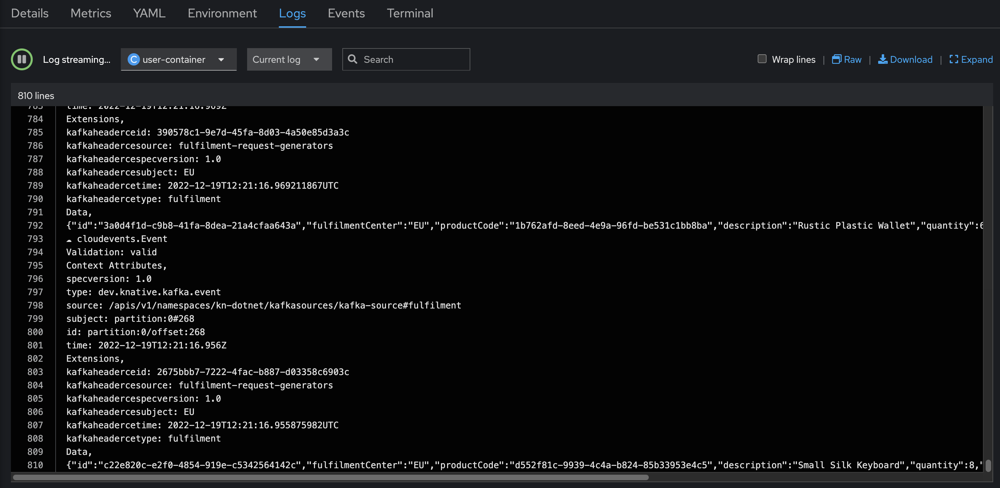
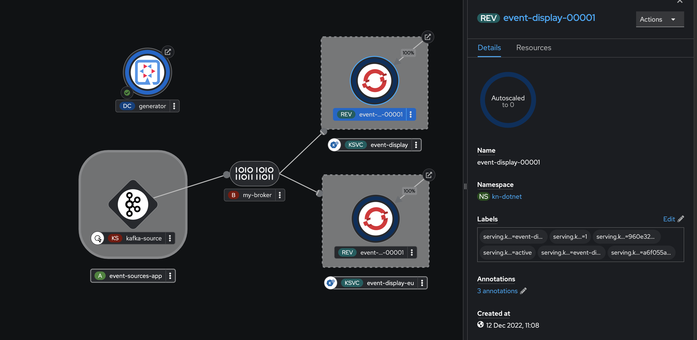

# Serverless Eventing Demo

For more information, please see the [official product documentation](https://docs.openshift.com/container-platform/4.11/serverless/serverless-release-notes.html)

## Table of Contents
- **[Key Eventing Concepts](#key-eventing-concepts)**<br>
- **[Pre-Requisites](#lets-setup-the-pre-requisites-for-the-demo)**<br>
- **[Creating a demo scenario](#lets-build-a-demo-service)**<br>
- **[Key takeaways](#key-takeaways)**<br>
- **[Cleaning up](#clean-things-up)**<br>
---

OpenShift provides developers the capability to build serverless applications using the knative framework.


But first, let's explain some of the key concepts, before diving into a more concrete example.

# Key Eventing Concepts

## CloudEvents

CloudEvents (cloudevents.io) provide a consistent message format that can be used in eventing systems. This specification has already been adopted by all major cloud providers and simplify the way we interact with eventing systems by providing a standardized message format to allow interoperability between different implementations.

The message is structured in a way that it contains metadata for a event and a data element that contains the actual payload of the event.

```json
{
    "specversion" : "1.0",
    "type" : "com.example.someevent",
    "source" : "/mycontext",
    "subject": null,
    "id" : "C234-1234-1234",
    "time" : "2018-04-05T17:31:00Z",
    "comexampleextension1" : "value",
    "comexampleothervalue" : 5,
    "datacontenttype" : "application/json",
    "data" : {
        "appinfoA" : "abc",
        "appinfoB" : 123,
        "appinfoC" : true
    }
}
```

As you can see this specification provides a flexible message structure that allows us to standardize on events that flow through our applications. This also simplifies maintenance on our applications as this format is easily extendable without major refactor of our code and infrastructure causing a ripple effect through our entire solution.

## Event Source

An event source acts links a provider of events to your knatvie eventing system. It defines the origin of generated events. There are multiple different event sources that are provided by standard, for example a event source that listens to a kafka topic. Additional event sources can also be made available to the platform by installing the Camel-K operator in OpenShift. 


## Event Sink

An event sink defines a target for events. In other words events from an event source gets propagated to an event sink. Examples of an event sink could be brokers, services, channels or event cloud provider services like databases. Additional event sources can also be made available to the platform by installing the Camel-K operator in OpenShift.


## Channels and Brokers

Channels and Brokers allow us to distribute events between multiple components in our event based solution in a scalable way. They help us to define where events are routed and distributed.

Channels define essentially a single message type distribution between event subscribers, allowing us to fan out events to multiple subscribers. Channels are mostly used when we have simple event routing requirements or need to perform data transformation steps between services.

Brokers create a more scalable event mesh that allows us to distribute multiple message types between multiple event sinks. Triggers can be defined to route different message types to different event sinks or we can also route events based on payload information.


## Putting it all together


# Let's setup the pre-requisites for the demo

## Creating a kafka instance for our eventing backbone

Knative ships with an in-memory channel based broker implementation that is fine to use for development purposes. However for production use, it is recommended to use a kafka based implementation. In this case we will setup kafka to serve as the backbone for our example.

### Installing the AMQ Streams operator

First we will install the AMQ Streams operator that will allow us to create kafka instances.


```shell
oc apply -f ./03-RUN/serverless-eventing/amq-streams-setup/amq-streams-operator-sub.yaml
```

### Creating a kafka instance

Next, we will create a namespace for our kafka broker and then create a kafka instance.

```shell
oc apply -f ./03-RUN/serverless-eventing/amq-streams-setup/kafka-namespace.yaml
oc apply -f ./03-RUN/serverless-eventing/amq-streams-setup/kafka-instance.yaml
```

Note: In our example we use persistent volume claims for the kafka storage, you can also opt for ephemeral storage for development purposes. If this is the case use the kafka-instance-ephemeral.yaml manifest to create your kafka instance.

### Setting up the Serverless Operator

In case you have not setup the serverless operator yet, you can do that by executing the following command:

```shell
oc apply -f ./03-RUN/serverless-eventing/serverless-operator-setup/serverless-operator-setup.yaml
```

### Setup the Serverless Serving Component

In order to deploy the demo (and to use eventing), an instance of Knative Serving needs to be installed.

```shell
oc apply -f ./03-RUN/serverless-eventing/knative-serving-setup/knative-serving-instance.yaml
```

### Creating a KnativeEventing instance

Next we create a KnativeEventing instance to configure all the required serverless components to support eventing. In this case we also configure the default channel and broker implementation to use kafka as the default type.

```shell
oc apply -f ./03-RUN/serverless-eventing/knative-eventing-setup/knative-eventing-instance.yaml
```

Switch to the knative-eventing namespace and verify that all pods have started properly before moving to the next step.

### Creating a KnativeKafka instance

Next we create a knative-kafka instance the configures knative eventing to use our previously setup kafka cluster. Note here that this CR contains the bootstrap addresses for our kafka cluster.

```shell
oc apply -f ./03-RUN/serverless-eventing/knative-eventing-setup/knative-kafka-instance.yaml
```


# Let's build a demo service

For this demo we will have a fairly simple use case to explain the concepts. In this use case we have a request generator that generates random order fulfilment requests that can either be fulfilled by an EU or a US fulfilment center. When a new fulfilment request is produced on a kafka topic, we will route it via our event mesh broker to an appropriate serverless service to fulfil the request. In our example the target serverless services simply print the request to the log for us to check.


## Create a new project

```shell
$ oc new-project kn-dotnet

Now using project "kn-dotnet" on server "https://api.sno-local.phybernet.org:6443".

You can add applications to this project with the 'new-app' command. For example, try:

    oc new-app rails-postgresql-example

to build a new example application in Ruby. Or use kubectl to deploy a simple Kubernetes application:

    kubectl create deployment hello-node --image=k8s.gcr.io/e2e-test-images/agnhost:2.33 -- /agnhost serve-hostname
```

## Create a broker 

In this example we will create a broker instance that will serve as the event mesh to distribute our received events to event sinks.

First let's list the current brokers:

```shell
$ kn broker list
No brokers found.
```

Now, let's create a broker:

```shell
$ kn broker create my-broker
```

This takes a while for the broker to be ready. Once it is ready we can see the URL for the broker and see all the conditions show an OK status.

```shell
$ kn broker list
NAME        URL                                                                                  AGE   CONDITIONS   READY   REASON
my-broker   http://kafka-broker-ingress.knative-eventing.svc.cluster.local/kn-dotnet/my-broker   47h   7 OK / 7     True    
```

If you describe the broker, you can see from the Annotations that the broker class is of type Kafka.

```shell
$ kn broker describe my-broker
Name:         my-broker
Namespace:    kn-dotnet
Annotations:  eventing.knative.dev/broker.class=Kafka, eventing.knative.dev/creator=kube:admin, e ...
Age:          1d

Address:  
  URL:    http://kafka-broker-ingress.knative-eventing.svc.cluster.local/kn-dotnet/my-broker

Conditions:  
  OK TYPE                  AGE REASON
  ++ Ready                  1m 
  ++ Addressable            1d 
  ++ ConfigMapUpdated       1d Config map knative-eventing/kafka-broker-brokers-triggers updated
  ++ ConfigParsed           1d 
  ++ DataPlaneAvailable     1d 
  ++ ProbeSucceeded         1m 
  ++ TopicReady             1d Topic knative-broker-kn-dotnet-my-broker created

```

## Deploy our generator application

In our use case, we will deploy a generator application which will generate random fulfilment request events on a kafka topic. In this case we have a simple quarkus application that exposes a REST api that allows us to specify the number of requests we need to generate. This application will generate the events on the fulfilment topic on our kafka broker.

In order to deploy the application, we will make use of the quarkus-openshift extension to deploy the application directly from our IDE.

Navigate to the ./03-RUN/serverless-eventing/demo/generator folder in a terminal.

Run the following command to deploy our application (make sure you have logged in with oc and you are working in the correct project)

```shell
mvn quarkus:build -Dquarkus.kubernetes.deploy=true -Dquarkus.openshift.env.vars.kafka-bootstrap-servers=my-cluster-kafka-bootstrap.knative-kafka.svc:9091,my-cluster-kafka-bootstrap.knative-kafka.svc:9092,my-cluster-kafka-bootstrap.knative-kafka.svc:9093  -Dquarkus.kubernetes-client.trust-certs=true -Dquarkus.openshift.route.expose=true
```

This will build your application and create all the required deploymentconfigs on your Openshift environment.

## Create a kafka event source

Next we will create a kafka event source to listen to our "fulfilment" topic and distribute it to events sinks via the broker.

```shell
oc apply -f ./03-RUN/serverless-eventing/demo/kafka-event-source/kafka-event-source.yaml
```

This configuration sets up the connection to our kafka cluster, specifies the topic to listen to and routes the events to our event broker.

## Deploy our fulfilment center event sink services

Next, we will deploy to event sinks for our EU and US fulfilment centers respectively. These event sinks will simply print the events they receive to the container logs. We will create 2 similar event sinks deployed as serverless serving deployments. This means that when there are no events to process, they will scale to zero. When events are received they will scale up to process all the incoming requests.

```shell
oc apply -f ./03-RUN/serverless-eventing/demo/event-display/event-display-service-sink-EU.yaml
oc apply -f ./03-RUN/serverless-eventing/demo/event-display/event-display-service-sink-US.yaml
```

## Create triggers

Finally, we will create 2 broker triggers that will route events to the appropriate fulfilment center event sink. The trigger in this case specifies a header field to route on and a target event sink to route to.

```shell
oc apply -f ./03-RUN/serverless-eventing/demo/event-triggers/event-trigger-EU.yaml
oc apply -f ./03-RUN/serverless-eventing/demo/event-triggers/event-trigger-US.yaml
```

## Testing our application

In order to test our application, we will use curl to invoke our generator service, passing it the number of fulfilment events to generate. First, though, let's verify our services are scaled down in the Developer Topology:


Now, let's generate some events

```shell
curl -skq -X POST -H "Content-Type: application/json" -d '{"numberOfRequests":100}'  http://generator-kn-dotnet.apps.sno-local.phybernet.org/fulfilment-requests
```

This will generate 100 new fulfilment requests with a random fulfilment center code and publish this to our kafka topic.

In the Developer Topology view, you can now see the fulfilment services scaling up to handle the requests:


If we have a look at the logs of the running pods, we can see that our events are routed to the correct fulfilment center service.

First the US fulfilment center:


Then the EU fulfilment center:




Once our events have finished processing, our services start to scale down again. As you can see this happens dynamically based on the load/number of events received.



# Key takeaways

* CloudEvents give us the interoperability which allows us to easily expand our applications listening and reacting to events. A common message format minimizes the impact to our applications or infrastructure if the data payload changes.
* Eventing gives us flexibility to react in near realtime to events generated either in our applications or based on events from external systems
* Serverless allows us to scale effectively on demand, creating reactive systems that work efficiently with our cluster resources.


# Clean Things Up

```shell
oc delete project kn-dotnet
```
