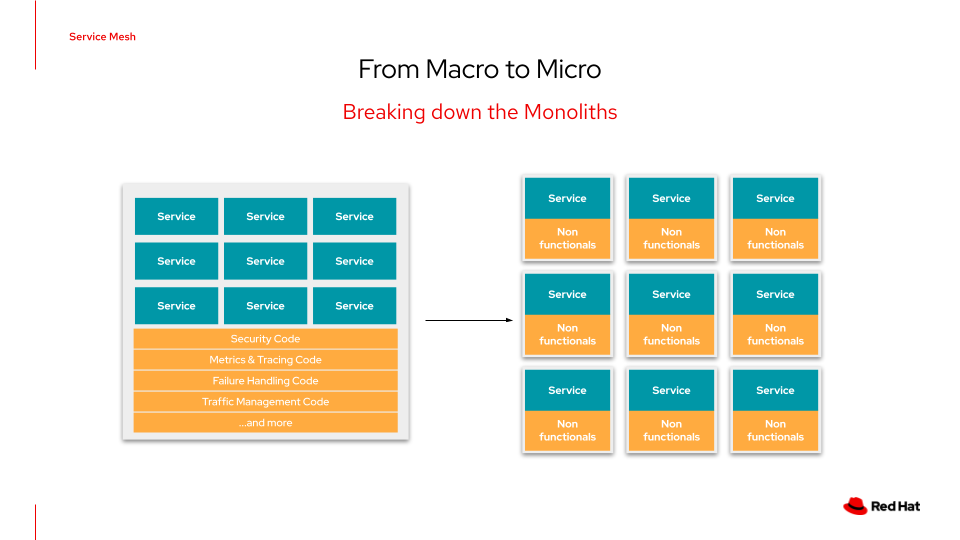
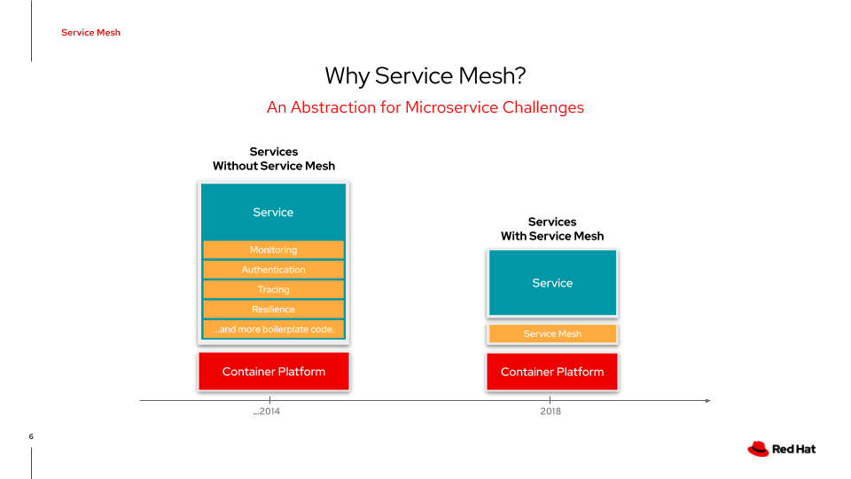
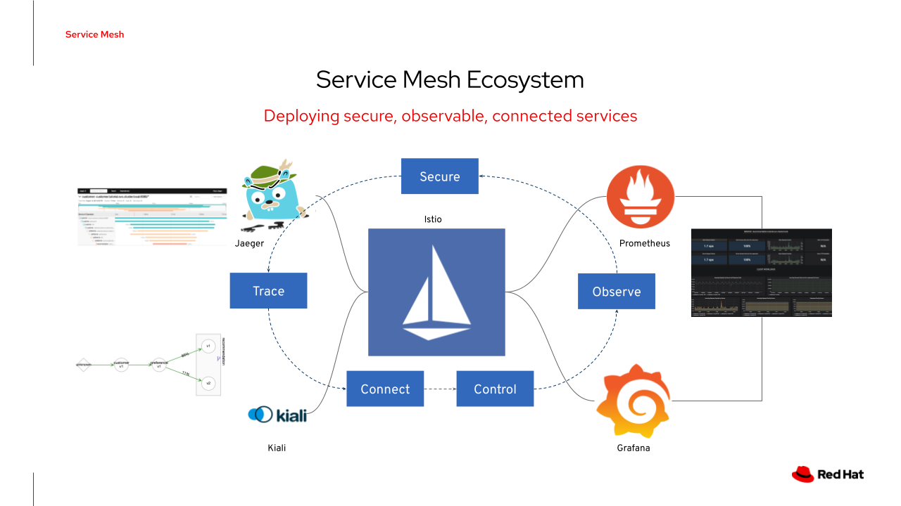
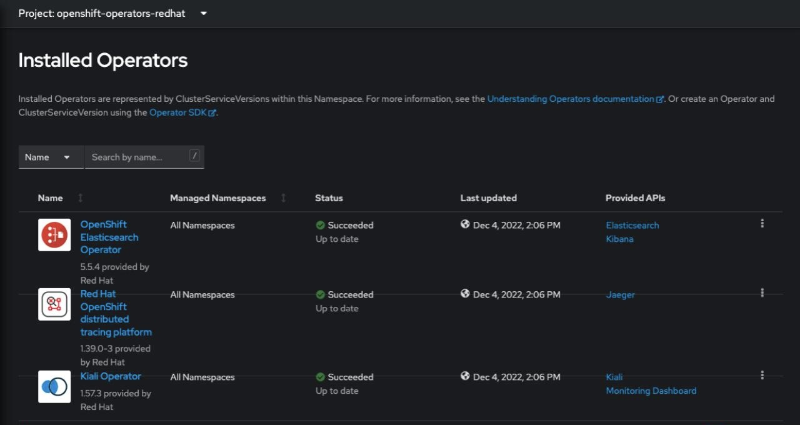
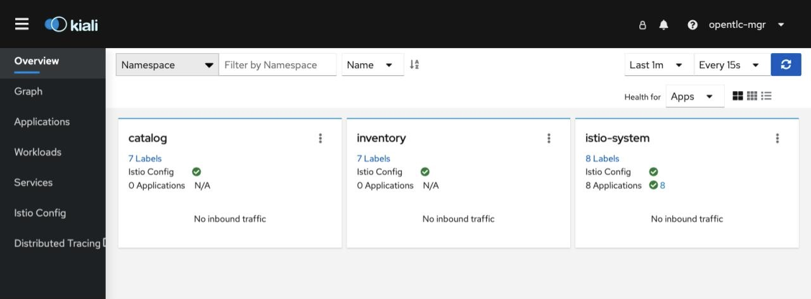
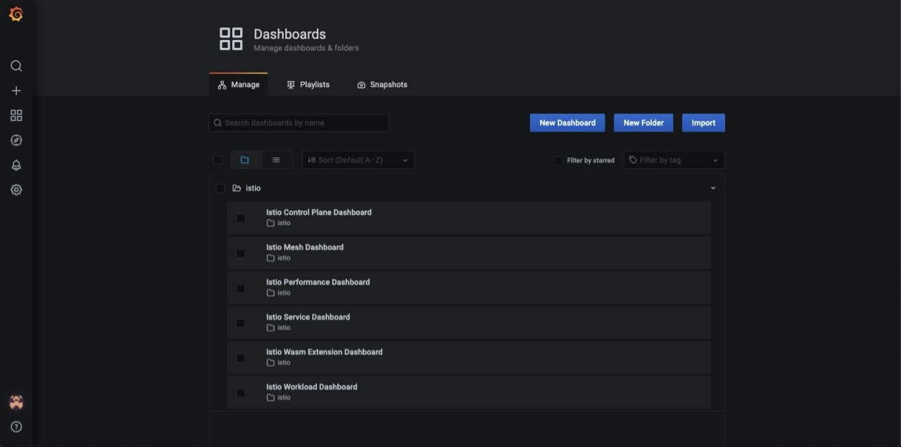
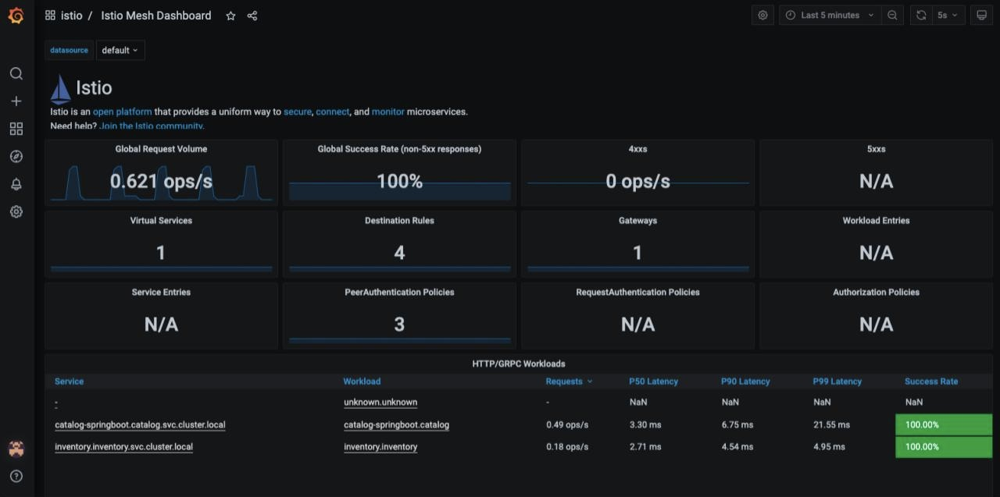

# 5-minute demo: OpenShift Service Mesh
For more information, please see the [official product documentation](https://docs.openshift.com/container-platform/4.6/service_mesh/v2x/ossm-about.html).

## Table of Contents
- **[Introduction to OpenShift Service Mesh](#introduction-to-openshift-service-mesh)**<br>
- **[Service Mesh Ecosystem](#service-mesh-ecosystem)**<br>
- **[Installing Red Hat OpenShift Service Mesh](#installing-red-hat-openshift-service-mesh)**<br>
- **[Getting Started with Service Mesh](#getting-started-with-service-mesh)**<br>
- **[Advanced Service Mesh Development](#advanced-service-mesh-development)**<br>
- **[Key takeaways](#)**<br>

---

## Introduction to OpenShift Service Mesh
Service mesh is a technology designed to help developers address microservice architecture problems in a unified and centralized way.
It abstracts non-functional application components from developers and groups them in a centralized point of control so they can be reused by many or all microservices in an application.

Microservice architectures split the work of enterprise applications into modular services, which can make scaling and maintenance easier. However, as an enterprise application built on a microservice architecture grows in size and complexity, it becomes difficult to understand and manage.



Service Mesh can address those architecture problems by capturing or intercepting traffic between services and can modify, redirect, or create new requests to other services.



Service Mesh, which is based on the open-source [Istio project](https://istio.io/), provides an easy way to create a network of deployed services that provides discovery, load balancing, service-to-service authentication, failure recovery, metrics, and monitoring.

A service mesh also provides more complex operational functionality, including A/B testing, canary releases, access control, and end-to-end authentication.

### Core features

- **Traffic Management** - Control the flow of traffic and API calls between services, make calls more reliable, and make the network more robust in the face of adverse conditions.
- **Service Identity and Security** - Provide services in the mesh with a verifiable identity and provide the ability to protect service traffic as it flows over networks of varying degrees of trustworthiness.
- **Policy Enforcement** - Apply organizational policy to the interaction between services, ensure access policies are enforced and resources are fairly distributed among consumers. Policy changes are made by configuring the mesh, not by changing application code.
- **Telemetry** - Gain understanding of the dependencies between services and the nature and flow of traffic between them, providing the ability to quickly identify issues.

---

## Service Mesh Ecosystem



OpenShift Service Mesh incorporates and extends several open-source projects and orchestrates them to provide an improved developer experience:
- **Istio** is the core implementation of the service mesh architecture for the Kubernetes platform. Istio creates a control plane that centralizes service mesh capabilities and a data plane that creates the structure of the mesh.
- **Maistra** is an open-source project based on Istio that adapts Istio features to the edge cases of deployment in the OpenShift Container Platform.
- **Jaeger** is an open-source traceability server that centralizes and displays traces associated with a single request. A trace contains information about all services that a request reached.
- **ElasticSearch** is an open-source, distributed, JSON-based search and analytics engine.
- **Kiali** provides service mesh observability. Kiali discovers microservices in the service mesh and their interactions and visually represents them.
- **Prometheus** is an open-source monitoring system with a dimensional data model for storing services telemetry information.
- **Grafana** is used to analyze service mesh metrics.

The **3scale Istio adapter** is an optional component that integrates OpenShift Service Mesh with Red Hat 3scale API Management solutions. The default OpenShift Service Mesh installation does not include this component.

---

## Installing Red Hat OpenShift Service Mesh

The installation of OpenShift Service Mesh has to be executed in three steps.
1. **[Install Prerequisites](#install-prerequisites)**
2. **[Install Service Mesh Operator](#install-service-mesh-operator)**
3. **[Create an instance of Service Mesh Control Plane](#create-an-instance-of-service-mesh-control-plane)**

### Install Prerequisites

First we have to install following operators in our cluster:
- [Openshift Elasticsearch Operator](https://github.com/redhat-cop/gitops-catalog/tree/main/elasticsearch-operator)
- [Red Hat Openshift Jaeger Operator](https://github.com/redhat-cop/gitops-catalog/tree/main/jaeger-operator)
- [Kiali Operator](https://github.com/redhat-cop/gitops-catalog/tree/main/kiali-operator)

Procedure:
1. Log in to the OpenShift Container Platform web console as a user with the cluster-admin role. If you use Red Hat OpenShift Dedicated, you must have an account with the dedicated-admin role.
2. In the OpenShift Container Platform web console, click Operators → OperatorHub.
3. Type the name of the Operator into the filter box and select the Red Hat version of the Operator. Community versions of the Operators are not supported.
4. Click Install.
5. On the Install Operator page for each Operator, accept the default settings.
6. Click Install. Wait until the Operator has installed before repeating the steps for the next Operator in the list.

**Note:** If you don't want to use OpenShift Console GUI for installing Service Mesh Operator, you can use [github.com/redhat-cop/gitops-catalog](https://github.com/redhat-cop/gitops-catalog/tree/main/openshift-servicemesh).

- Install all prerequisites:
```shell
oc apply -k https://github.com/redhat-cop/gitops-catalog/elasticsearch-operator/overlays/stable &&\
oc apply -k https://github.com/redhat-cop/gitops-catalog/jaeger-operator/overlays/stable &&\
oc apply -k https://github.com/redhat-cop/gitops-catalog/kiali-operator/overlays/stable
```
```shell
namespace/openshift-operators-redhat created
operatorgroup.operators.coreos.com/openshift-operators-redhat created
subscription.operators.coreos.com/elasticsearch-operator created
subscription.operators.coreos.com/jaeger-product created
subscription.operators.coreos.com/kiali-ossm created
```

Wait for ES, Jaeger and Kiali operators to become ready. 



### Install Service Mesh operator


- [OpenShift ServiceMesh Operator](https://github.com/redhat-cop/gitops-catalog/tree/main/openshift-servicemesh/operator)

```shell
oc apply -k https://github.com/redhat-cop/gitops-catalog/openshift-servicemesh/operator/overlays/stable
```
```shell
subscription.operators.coreos.com/servicemeshoperator created
```

The Red Hat OpenShift Service Mesh Operator does not create the various Service Mesh custom resource definitions (CRDs) until you deploy a Service Mesh Control Plane instance.

### Create an instance of Service Mesh Control Plane

The Control Plane instance will be used to install and configure all necessary Service Mesh components. 

- Installs the Control Plane component of OpenShift ServiceMesh.

```shell
oc apply -k https://github.com/redhat-cop/gitops-catalog/openshift-servicemesh/instance/overlays/default
```
```shell
namespace/istio-system created
servicemeshcontrolplane.maistra.io/istio-system created
```

This will create a new project named istio-system and will deploy a service mesh control plain.
We can watch creation of pods with following command:

```shell
oc get pods -n istio-system -w
```
The output should be similar to this:
```shell
NAME                                        READY   STATUS    RESTARTS   AGE
grafana-5555d857f7-tp78d                    2/2     Running   0          3m31s
istio-egressgateway-6865995bc7-68kl7        1/1     Running   0          3m31s
istio-ingressgateway-7b9966c9b-xncx2        1/1     Running   0          3m32s
istiod-istio-system-6cb497c876-ptwxg        1/1     Running   0          11m
jaeger-7c47c46658-f6rwj                     2/2     Running   0          3m29s
kiali-85c5b45d8f-94hv8                      1/1     Running   0          95s
prometheus-7b64fbf758-snfq8                 2/2     Running   0          4m37s
wasm-cacher-istio-system-555fd6f7df-6qrnm   1/1     Running   0          2m1s

```

---

## Getting Started with Service Mesh
In this demo, we'll visualize our service mesh using Kiali, Prometheus, and Grafana, and we'll see how to configure basic Istio functionalities such as VirtualService and A/B Testing.

- [Install demo application and add it to the mesh](#install-demo-application-and-add-it-to-the-mesh)
  - [Create application namespaces](#create-application-namespaces)
  - [Add application namespaces to the mesh](#create-servicemeshmemberroll)
  - [Deploy application services](#deploy-application-services)
  - [Enabling automatic sidecar injection](#enabling-automatic-sidecar-injection)
  - [Expose a service](#expose-a-service)
- [Observe your services with Kiali, Prometheus, Jaeger and Grafana](#observe-your-services-with-kiali-prometheus-jaeger-and-grafana)
  - [Examine Kiali](#examine-kiali)
  - [Querying Metrics with Prometheus](#querying-metrics-with-prometheus)
  - [Visualizing Metrics with Grafana](#visualizing-metrics-with-grafana)

### Install demo application and add it to the mesh
We'll install a sample demo application into the system.
It's a typical microservice application that could be installed on any Kubernetes instance with or without Service Mesh.

**Catalog** - Spring Boot project

**Inventory** - Quarkus project


- #### Create application namespaces
```shell
oc create -f ./demo/demo-namespaces.yaml
```
```shell
namespace/catalog created
namespace/inventory created
```

Before we start deploying our application we need to make sure we have the right access to our different application namespaces. 
The ServiceMeshControlPlane that includes Elasticsearch, Jaeger, Kiali and Service Mesh Operators, have all been installed at the cluster provisioning time. 
However for applications to communicate to each other accross different namespaces, we need to ensure that the ServiceMeshMemberRoll is also created.

- #### Create ServiceMeshMemberRoll

```shell
oc create -f ./demo/service-mesh-member-roll.yaml
```
```shell
servicemeshmemberroll.maistra.io/default created
```

Now we have successfully created a ServiceMeshMemberRoll which will cause a new service mesh to be deployed into the istio-system project. let’s move on to deploy our application to our service mesh.

- #### Deploy application services

The following scripts will deploy our inventory and catalog service:
```shell
sh ./demo/istio/scripts/deploy-inventory.sh  && \
sh ./demo/istio/scripts/deploy-catalog.sh 3m
```

Let's check if our application is running:
```shell
oc get pods -n catalog --field-selector status.phase=Running &&\
oc get pods -n inventory --field-selector status.phase=Running
```
```shell
NAME                         READY   STATUS    RESTARTS   AGE
catalog-database-1-fbnws     1/1     Running   0          3m53s
catalog-springboot-1-c57cw   1/1     Running   0          3m8s
NAME                         READY   STATUS    RESTARTS   AGE
inventory-1-qmvsc            1/1     Running   0          4m33s
inventory-database-1-z96f5   1/1     Running   0          5m35s
```

- #### Enabling automatic sidecar injection

Red Hat OpenShift Service Mesh relies on a proxy sidecar within the application’s pod to provide Service Mesh capabilities to the application. 
We'll enable automatic sidecar injection using the annotation. 
This ensures that your application contains the appropriate configuration for the Service Mesh upon deployment. 
This method requires fewer privileges and does not conflict with other OpenShift capabilities such as builder pods.

First, we'll annotate our database deployments and wait for them to roll out new pods:
```shell
oc patch dc/inventory-database -n inventory --type='json' -p '[{"op":"add","path":"/spec/template/metadata/annotations", "value": {"sidecar.istio.io/inject": "'"true"'"}}]' && \
oc patch dc/catalog-database -n catalog --type='json' -p '[{"op":"add","path":"/spec/template/metadata/annotations", "value": {"sidecar.istio.io/inject": "'"true"'"}}]' && \
oc rollout status -w dc/inventory-database -n inventory && \
oc rollout status -w dc/catalog-database -n catalog
```
Next, let’s add sidecars to our services and wait for them to be re-deployed:
```shell
oc patch dc/inventory -n inventory --type='json' -p '[{"op":"add","path":"/spec/template/metadata/annotations", "value": {"sidecar.istio.io/inject": "'"true"'"}}]' && \
oc rollout latest dc/inventory -n inventory && \
oc patch dc/catalog-springboot -n catalog --type='json' -p '[{"op":"add","path":"/spec/template/metadata/annotations", "value": {"sidecar.istio.io/inject": "'"true"'"}}]' && \
oc rollout status -w dc/inventory -n inventory && \
oc rollout status -w dc/catalog-springboot -n catalog
```
This should also take about 1 minute to finish. 

When it’s done, verify that the inventory-database is running with 2 containers (2/2 in the READY column) with this command:
```shell
oc get pods -n catalog --field-selector status.phase=Running &&\
oc get pods -n inventory --field-selector status.phase=Running
```
```shell
NAME                         READY   STATUS    RESTARTS   AGE
catalog-database-2-qglw8     2/2     Running   0          89s
catalog-springboot-2-jhxtf   2/2     Running   0          36s
NAME                         READY   STATUS    RESTARTS   AGE
inventory-2-pqc2s            2/2     Running   0          38s
inventory-database-2-pmnnp   2/2     Running   0          90s
```

- #### Expose a service

Next, let’s create an ingress gateway to allow ingress traffic to the mesh.
And a virtual service to send incoming traffic to our app catalog service. 
```shell
oc create -f ./demo/catalog/rules/catalog-default.yaml -n catalog
```
```shell
gateway.networking.istio.io/catalog-gateway created
virtualservice.networking.istio.io/catalog-default created
```

- #### Let's test it!

Test that the gateway and VirtualService have been set correctly.

Set the Gateway URL.
```shell
export GATEWAY_URL=$(oc -n istio-system get route istio-ingressgateway -o jsonpath='{.spec.host}')
```
Set the port number. 
```shell
export TARGET_PORT=$(oc -n istio-system get route istio-ingressgateway -o jsonpath='{.spec.port.targetPort}')
```

Test a page that has been explicitly exposed.
```shell
curl -s -I "$GATEWAY_URL/services/products"
```
The expected result is 200.

Now let's keep those requests coming
```shell
for i in {1..1000} ; do curl -o /dev/null -s -w "%{http_code}\n" $GATEWAY_URL ; sleep 2 ; done

#or like this
while true; \
do curl -o /dev/null -s ${GATEWAY_URL}; \
sleep 2; done
```
This command will endlessly access the application and report the HTTP status result in a separate terminal window. The script should return an endless 200.

With this application load running, metrics will become much more interesting in the next few steps.

### Observe your services with Kiali, Prometheus, Jaeger and Grafana

#### Examine Kiali
Kiali allows you to manage and monitor your mesh from a single UI. This UI will allow you to view configurations, monitor traffic flow and health, and analyze traces.

Open the Kiali console.

- Get Kiali URL from the route in istio-system project namespace
```shell
KIALI_URL="http://$(oc get route kiali -o jsonpath="{.spec.host}" -n istio-system)"
```
Open Kiali in your browser
```shell
open -a "Google Chrome" $KIALI_URL
```


- Kiali - Service Graph

Click on the Graph page on the left and check Traffic Animation in Display. 
You’ll also need to select the application projects in the Namespace dropdown at the top

The graph shows all the microservices, connected by the requests going through them. 
On this page, we can see how services interact with each other. 

- Kiali - Applications

Click on Applications menu in the left navigation. 
On this page you can view a listing of all the services that are running in the cluster, and additional information about them, such as health status

- Kiali - Workloads

Click on the Workloads menu in the left navigation. 
On this page you can view a listing of all the workloads that are present in your application.

- Kiali - Services

Click on Services menu in the left navigation. 
Here, you can see the listing of all services.

- Kiali - Istio Config

Click on Istio Config menu in the left navigation. 
Here, you can see the listing of all Istio types.

- Kiali - Distributed Tracing

Kiali also features integration with Jaeger. 
This lets you follow the path of a request through various microservices that make up an application (without having to update the app itself!).

To view the traces being generated, click on the Distributed Tracing link on the left or run the following commands:
```shell
JAEGER_URL="https://$(oc get route jaeger -o jsonpath="{.spec.host}" -n istio-system)"
```
Open Jaeger in your browser
```shell
open -a "Google Chrome" $JAEGER_URL
```

#### Querying Metrics with Prometheus
Prometheus will periodically scrape applications to retrieve their metrics (by default on the /metrics endpoint of the application). The Prometheus add-on for Istio is a Prometheus server that comes pre-configured to scrape Istio Mixer endpoints to collect its exposed metrics. It provides a mechanism for persistent storage and querying of those metrics metrics.

Open the Prometheus console and click on Log in with OpenShift.
You should see OpenShift Login screen. 
Enter the username and password as below and click Log In. 
If you have Requested permissions to authorize access Prometheus, click on Allow selected permissions.

```shell
PROMETHEUS_URL="https://$(oc get route prometheus -o jsonpath="{.spec.host}" -n istio-system)"
```
Open Jaeger in your browser
```shell
open -a "Google Chrome" $PROMETHEUS_URL
```

- In the Expression input box at the top of the web page, enter the following text.

```shell
istio_request_duration_milliseconds_count
```
Then, click the Execute button.

You should see a listing of each of the application’s services along with a count of how many times it was accessed.
You can also graph the results over time by clicking on the Graph tab

Other expressions to try:

- Total count of all requests to productpage service:

```shell
istio_request_duration_milliseconds_count{destination_service=~"catalog-springboot.*"}
```
- Total count of all requests to v3 of the reviews service:

```shell
istio_request_duration_milliseconds_count{destination_service=~"reviews.*", destination_version="v3"}
```

- Rate of requests over the past 5 minutes to all productpage services:

```shell
rate(istio_request_duration_milliseconds_count{destination_service=~"inventory.*", response_code="200"}[5m])
```

There are many, many different queries you can perform to extract the data you need. 
Consult the [Prometheus documentation](https://prometheus.io/docs) for more detail.


#### Visualizing Metrics with Grafana
Grafana provides a visual representation of many available Prometheus metrics extracted from the Istio data plane and can be used to quickly spot problems and take action.

- Open Grafana console
```shell
GRAFANA_URL="https://$(oc get route grafana -o jsonpath="{.spec.host}" -n istio-system)"
```
Open Grafana in your browser
```shell
open -a "Google Chrome" $GRAFANA_URL
```
You should see OpenShift Login screen. Enter the username and password as below and click Log In. If you have Requested permissions to authorize access Prometheus, click on Allow selected permissions.



- Istio Mesh Metrics
Select Dashboard Icon > Manage > Istio > Istio Mesh Dashboard to see Istio mesh metrics



The Grafana Dashboard for Istio consists of three main sections:

- A Global Summary View provides a high-level summary of HTTP requests flowing through the service mesh.
- A Mesh Summary View provides slightly more detail than the Global Summary View, allowing per-service filtering and selection.
- Individual Services View provides metrics about requests and responses for each individual service within the mesh (HTTP and TCP).

- Istio Workload Metrics
To switch to the workloads dashboard, select Dashboard Icon > Manage > Istio > Istio Workload Dashboard from the drop-down list in the top left corner of the screen.

This dashboard shows workload’s metrics, and metrics for client-(inbound) and service (outbound) workloads. You can switch to a different workload, ot filter metrics by inbound or outbound workloads by using drop-down lists at the top of the dashboard.

For more on how to create, configure, and edit dashboards, please see the [Grafana documentation](http://docs.grafana.org/).

---
## Advanced Service Mesh Development

Here, we will learn the advanced use cases of service mesh. 
Our demo will showcase features such as:
- [Fault Injection](#fault-injection)
- Traffic Shifting
- [Circuit Breaking](#Enable Circuit Breaker)
- Rate Limiting

These features are important for any distributed applications built on top of Kubernetes/Openshift.

### Fault Injection

In this demo, we'll show how to use Fault Injection to test the end-to-end failure recovery capability of the application as a whole.

Istio provides a set of failure recovery features that can be taken advantage of by the services in an application.
Features include:

- Timeouts to minimize wait times for slow services
- Bounded retries with timeout budgets and variable jitter between retries
- Limits on the number of concurrent connections and requests to upstream services
- Active (periodic) health checks on each member of the load-balancing pool
- Fine-grained circuit breakers (passive health checks) – applied per instance in the load-balancing pool

These features can be dynamically configured at runtime through Istio's traffic management rules.

Istio also enables protocol-specific fault injection into the network by delaying or corrupting packets at the TCP layer.

Two types of faults can be injected:

- Delays are timing failures. They mimic increased network latency or an overloaded upstream service.
- Aborts are crash failures. They mimic failures in upstream services. Aborts usually manifest in the form of HTTP error codes or TCP connection failures.

To test our application microservices for resiliency, we will inject a failure in 50% of the requests to the inventory service, causing the service to appear to fail (and return HTTP 5xx errors) half of the time.

Note: Make sure our GATEWAY_URL is available
```shell
export GATEWAY_URL=$(oc -n istio-system get route istio-ingressgateway -o jsonpath='{.spec.host}')
```

Create the new VirtualService to direct traffic to the inventory service by running the following command
```shell
oc apply -f - << EOF
apiVersion: networking.istio.io/v1alpha3
kind: VirtualService
metadata:
  name: inventory-default
spec:
  hosts:
  - "${GATEWAY_URL}"
  gateways:
  - catalog/catalog-gateway
  http:
    - match:
      - uri:
          exact: /services/inventory
      - uri:
          exact: /
      route:
      - destination:
          host: inventory
          port:
            number: 80
EOF
```

Let’s inject a failure (500 status) in 50% of requests to inventory microservices.
Before creating a new inventory-fault VirtualService, we need to delete the existing inventory-default virtualService.
```shell
oc delete virtualservice/inventory-default -n inventory 
```

```shell
oc apply -f - << EOF
apiVersion: networking.istio.io/v1alpha3
kind: VirtualService
metadata:
  name: inventory-fault
spec:
  hosts:
  - "${GATEWAY_URL}"
  gateways:
  - catalog/catalog-gateway
  http:
    - fault:
         abort:
           httpStatus: 500
           percentage:
             value: 50
      route:
        - destination:
            host: inventory
            port:
              number: 80
EOF
```

Let’s find out if the fault injection works correctly via accessing the CoolStore Inventory page once again. 
You will see that the Status of CoolStore Inventory continues to change between DEAD and OK.


Back on the Kiali Graph page and you will see red traffic from istio-ingressgateway as well as around 50% of requests are displayed as 5xx on the right side, HTTP Traffic. 
It may not be exactly 50% since some traffic is coming from the catalog and ingress gateway at the same time, but it will approach 50% over time.


Let’s now add a 5 second delay for the inventory service.

First, delete the existing inventory-fault VirtualService:
```shell
oc delete virtualservice/inventory-fault -n inventory
```

Then create a new virtualservice
```shell
oc apply -f - << EOF
apiVersion: networking.istio.io/v1alpha3
kind: VirtualService
metadata:
  name: inventory-fault-delay
spec:
  hosts:
  - "${GATEWAY_URL}"
  gateways:
  - catalog/catalog-gateway
  http:
    - fault:
         delay:
           fixedDelay: 5s
           percentage:
             value: 100
      route:
        - destination:
            host: inventory
            port:
              number: 80
EOF
```

Go to the Kiali Graph you opened earlier and you will see that the green traffic from istio-ingressgateway is delayed for requests coming from inventory service.

Click on the "edge" (the line between istio-ingressgateway and inventory) and then scroll to the bottom of the right-side graph showing the HTTP Request Response Time. Hover over the black average data point to confirm that the average response time is about 5000ms (5 seconds) as expected


Before we will move to the next step, clean up the fault injection and set the default virtual service once again using these commands in a Terminal:

```shell
oc delete virtualservice/inventory-fault-delay -n inventory && \
oc create -f ./demo/inventory/rules/inventory-default.yaml -n inventory
```

### Enable Circuit Breaker

In this demo, we'll configure a Circuit Breaker to protect the calls to the Inventory service.
If the Inventory service gets overloaded due to call volume, Istio will limit future calls to the service instances to allow them to recover.

Istio enforces circuit breaking limits at the network level as opposed to having to configure and code each application independently.

Istio supports various types of conditions that would trigger a circuit break:

- Cluster maximum connections: The maximum number of connections that Istio will establish to all hosts in a cluster.
- Cluster maximum pending requests: The maximum number of requests that will be queued while waiting for a ready connection pool connection.
- Cluster maximum requests: The maximum number of requests that can be outstanding to all hosts in a cluster at any given time.
- Cluster maximum active retries: The maximum number of retries that can be outstanding to all hosts in a cluster at any given time.

Each circuit breaking limit is configurable and tracked per upstream cluster and priority basis. This allows different components of the distributed system to be tuned independently and have different limits. See Envoy's circuit breaker documentation for more details.

Let's add a circuit breaker to the calls to the Inventory service.
Instead of using a VirtualService object, circuit breakers in Istio are defined as DestinationRule objects.
DestinationRule defines policies that apply to traffic intended for a service after routing has occurred.
These rules specify configuration for load balancing, connection pool size from the sidecar, and outlier detection settings to detect and evict unhealthy hosts from the load balancing pool.

Run the following command to enable circuit breaking:
```shell
oc apply -f - << EOF
apiVersion: networking.istio.io/v1alpha3
kind: DestinationRule
metadata:
  name: inventory-cb
spec:
  host: inventory
  trafficPolicy:
    connectionPool:
      tcp:
        maxConnections: 1
      http:
        http1MaxPendingRequests: 1
        maxRequestsPerConnection: 1
EOF
```

We set the Inventory service’s maximum connections to 1 and maximum pending requests to 1. 
Thus, if we send more than 2 requests within a short period of time to the inventory service, 1 will go through, 1 will be pending, and any additional requests will be denied until the pending request is processed. 
Furthermore, it will detect any hosts that return a server error (HTTP 5xx) and eject the pod out of the load balancing pool for 15 minutes. 
You can visit here to check the [Istio spec](https://istio.io/docs/tasks/traffic-management/circuit-breaking) for more details on what each configuration parameter does.


siege --verbose --time=1M --concurrent=10 'http://'$GATEWAY_URL
