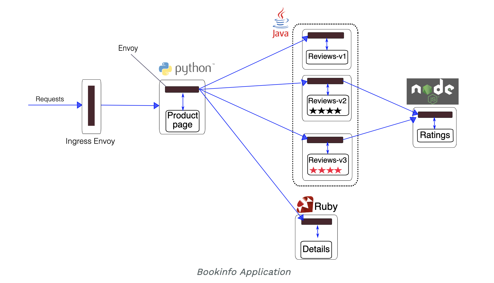

https://github.com/dotnet-architecture/eShopOnContainers
https://redhat-scholars.github.io/openshift-starter-guides-dotnet/rhs-openshift-starter-guides-dotnet/4.6/nationalparks-dotnet-pipeline.html
https://odo.dev/docs/user-guides/quickstart/dotnet/
https://odo.dev/docs/user-guides/advanced/deploy/dotnet/
https://access.redhat.com/documentation/en-us/red_hat_enterprise_linux/8/html/developing_.net_applications_in_rhel_8/using-net-core-on-ocp_gsg

The application is called Bookinfo, a simple application that displays information about a book, similar to a single catalog entry of an online bookstore.
Displayed on the page is a description of the book, book details (ISBN, number of pages, and so on), and a few book reviews.

The BookInfo application is broken into four separate microservices:
- **productpage** - The productpage microservice calls the details and reviews microservices to populate the page.
- **details** - The details microservice contains book information.
- **reviews** - The reviews microservice contains book reviews. It also calls the ratings microservice to show a "star" rating for each book.
- **ratings** - The ratings microservice contains book rating information that accompanies a book review.

There are 3 versions of the reviews microservice:
- Version **v1** does not call the ratings service.
- Version **v2** calls the ratings service, and displays each rating as 1 to 5 **black** stars.
- Version **v3** calls the ratings service, and displays each rating as 1 to 5 **red** stars.

The application architecture is described in the below diagram:

### Deploying BookInfo App

Open a terminal via CodeReady Workspaces and run the following commands to deploy the bookinfo app:

oc apply -n bookinfo -f ./demo/istio/bookinfo.yaml
And then create the ingress gateway for the bookinfo:

oc apply -n bookinfo -f ./demo/istio/bookinfo-gateway.yaml
The above default ingress manages traffic for any incoming host, but we only want it to manage traffic destined to our own ingress, so change the host from * to your specific host with this command:

oc patch -n bookinfo virtualservice/bookinfo --type='json' -p '[{"op":"add","path":"/spec/hosts","value": ["istio-ingressgateway-istio-system.apps.cluster-8dt7c.8dt7c.sandbox2556.opentlc.com"]}]'
Finally, add default destination rules (we’ll alter this later to affect routing of requests):

oc apply -n bookinfo -f ./demo/istio/destination-rule-all.yaml
List all available destination rules:

oc get -n bookinfo destinationrules
When the app is installed, each Pod will get an additional sidecar container as described earlier.

Add some nice labels to correspond to the different langages/frameworks used in the app:

oc project bookinfo && \
oc label deployment/productpage-v1 app.openshift.io/runtime=python --overwrite && \
oc label deployment/details-v1 app.openshift.io/runtime=ruby --overwrite && \
oc label deployment/reviews-v1 app.openshift.io/runtime=java --overwrite && \
oc label deployment/reviews-v2 app.openshift.io/runtime=java --overwrite && \
oc label deployment/reviews-v3 app.openshift.io/runtime=java --overwrite && \
oc label deployment/ratings-v1 app.openshift.io/runtime=nodejs --overwrite && \
oc label deployment/details-v1 app.kubernetes.io/part-of=bookinfo --overwrite && \
oc label deployment/productpage-v1 app.kubernetes.io/part-of=bookinfo --overwrite && \
oc label deployment/ratings-v1 app.kubernetes.io/part-of=bookinfo --overwrite && \
oc label deployment/reviews-v1 app.kubernetes.io/part-of=bookinfo --overwrite && \
oc label deployment/reviews-v2 app.kubernetes.io/part-of=bookinfo --overwrite && \
oc label deployment/reviews-v3 app.kubernetes.io/part-of=bookinfo --overwrite && \
oc annotate deployment/productpage-v1 app.openshift.io/connects-to=reviews-v1,reviews-v2,reviews-v3,details-v1 && \
oc annotate deployment/reviews-v2 app.openshift.io/connects-to=ratings-v1 && \
oc annotate deployment/reviews-v3 app.openshift.io/connects-to=ratings-v1
Let’s wait for our application to finish deploying. Go to the Topology View for the bookinfo project. You’ll see the app components spinning up:

service-mesh-05

Wait for each component to have the full blue circles, or you can execute the following commands to wait for the deployment to complete and result successfully rolled out:

oc rollout status -n bookinfo -w deployment/productpage-v1 && \
oc rollout status -n bookinfo -w deployment/reviews-v1 && \
oc rollout status -n bookinfo -w deployment/reviews-v2 && \
oc rollout status -n bookinfo -w deployment/reviews-v3 && \
oc rollout status -n bookinfo -w deployment/details-v1 && \
oc rollout status -n bookinfo -w deployment/ratings-v1

Finally, access the Bookinfo Product Page. It should look something like:

Reload the page multiple times. The three different versions of the Reviews service show the star ratings differently - v1 shows no stars at all, v2 shows black stars, and v3 shows red stars:

That’s because there are 3 versions of reviews deployment for our reviews service. Istio’s load-balancer is using a round-robin algorithm to iterate through the 3 instances of this service.

You should now have your OpenShift Pods running and have an Envoy sidecar in each of them alongside the microservice. The microservices are productpage, details, ratings, and reviews. Note that you’ll have three versions of the reviews microservice:

oc get pods -n bookinfo --selector app=reviews
The output from the above command should be similar but not the same, since pod names should be different.

NAME                          READY   STATUS    RESTARTS   AGE
reviews-v1-7754bbd88-dm4s5    2/2     Running   0          12m
reviews-v2-69fd995884-qpddl   2/2     Running   0          12m
reviews-v3-5f9d5bbd8-sz29k    2/2     Running   0          12m
Notice that each of the microservices shows 2/2 containers ready for each service (one for the service and one for its sidecar).

Now that we have our application deployed and linked into the Istio service mesh, let’s take a look at the immediate value we can get out of it without touching the application code itself!

Congratulations! You now successfully deployed your first application within your OpenShift Service Mesh. Lets move to the next lab Service Visulization and Montioring

