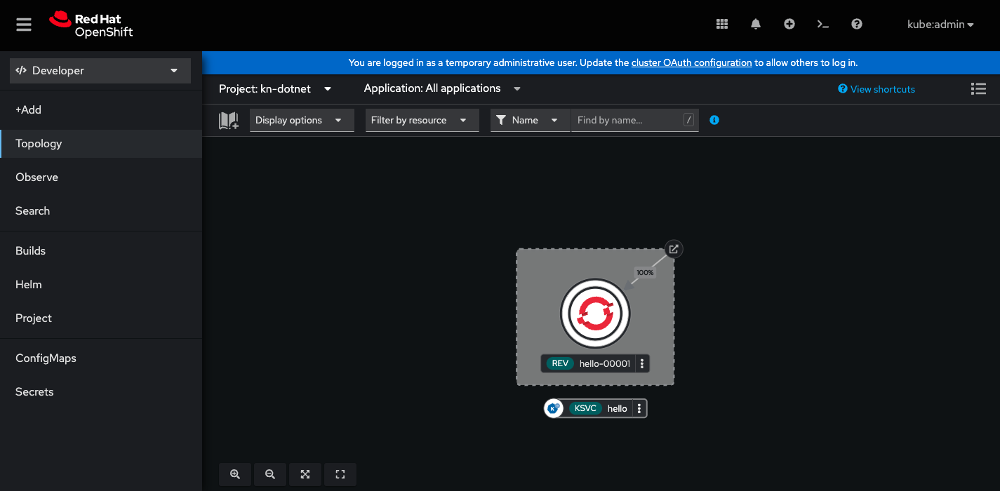
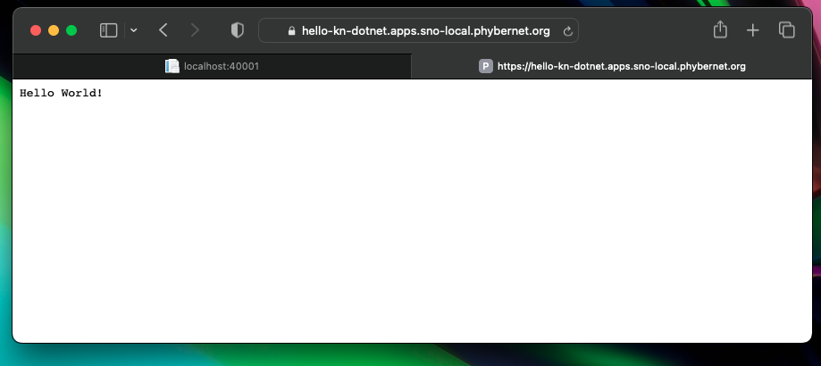

# 5-minute demo: Serverless (KNative Serving)
For more information, please see the [official product documentation](https://docs.openshift.com/container-platform/4.11/serverless/serverless-release-notes.html)

## Table of Contents
- **[Introduction to serverless](#introduction-to-serverless)**<br>
- **[Pre-Requisites](#pre-requisites)**<br>
- **[Creating an application](#creating-an-application)**<br>
- **[Creating a container](#creating-a-container)**<br>
- **[Creating a serverless deployment](#creating-a-serverless-deployment)**<br>
- **[Key takeaways](#key-takeaways)**<br>
- **[Cleaning up](#clean-things-up)**<br>
---

## Introduction to serverless
OpenShift Serverless .....


---

## Pre-requisites

* Installed serverless operator

```shell
oc apply -f ./run/01-serverless-serving/serverless-operator-setup/01-serverless-operator-namespace.yaml
oc apply -f ./run/01-serverless-serving/serverless-operator-setup/01-serverless-operator-sub.yaml
```
**NOTE**: These components might take a few minutes to complete the install, please verify the status in "installed operators" using the web console.

* Configured knative serving

```shell
oc apply -f ./run/01-serverless-serving/knative-serving-setup/knative-serving-instance.yaml
```
**NOTE**: These components might take a few minutes to complete the install, please verify that all pods are running in the knative-serving namespace using the web console.

* Podman or docker is available to build and push containers (note this instance needs to match the target platform architecture)
* Have a publically accessible registry available, eg. quay.io
* You have the [odo](https://developers.redhat.com/content-gateway/rest/mirror/pub/openshift-v4/clients/odo/) cli installed
* You have the [kn](https://docs.openshift.com/container-platform/4.11/serverless/cli_tools/installing-kn.html) cli installed

---

## Creating an application

Generate a new dotnet API:

```shell
dotnet new web -o hellodotnet -n app
cd hellodotnet/
```
(note the application name needs to be app)

Generate our devfile:

```shell
odo init --devfile dotnet60 --name=hellodotnet
```

Coding with live-deploy to a cluster:

```shell
odo dev
```

Once dev is done....

---

## Creating a container

In order to deploy our serverless service, we need a container to be created that we will use when we deploy. This requires some understanding on Dockerfiles.

Add dockerfile:

```dockerfile
FROM registry.access.redhat.com/ubi8/dotnet-60:latest as builder
WORKDIR /opt/app-root/src
COPY --chown=1001 . .
RUN dotnet publish -c Release


FROM registry.access.redhat.com/ubi8/dotnet-60:latest
EXPOSE 8080
COPY --from=builder /opt/app-root/src/bin /opt/app-root/src/bin
WORKDIR /opt/app-root/src/bin/Release/net6.0/publish
CMD ["dotnet", "app.dll"]
```

In this example we have created a multi-stage Dockerfile, that allows us to build our application in a build container and afterwards inject our application binaries into a runtime container. This gives you the flexibility to use a custom or minimal runtime image based on your corporate standards.

---

## Building a container

In this section we will build our container to be used in our serverless deployment. There are multiple ways of doing this and we will show you 2 examples. The first option will guide you through the process of modifying your devfile to allow odo to build the image and the second option will make use of podman/docker directly.

### Option 1:
edit devfile.yaml

add variables section:

```yaml
variables:
  CONTAINER_IMAGE: quay.io/bentaljaard/dotnet-helloworld
```

add new command:

```yaml
- id: build-image
  apply:
    component: outerloop-build
```

add new component:

```yaml
- name: outerloop-build
  image:
    dockerfile:
      buildContext: ${PROJECT_SOURCE}
      rootRequired: false
      uri: ./Dockerfile
    imageName: "{{CONTAINER_IMAGE}}"
```

set schema version:

```yaml
schemaVersion: 2.2.0
```

Use odo to build the image:

```shell
odo build-images
```
```shell
podman push quay.io/bentaljaard/dotnet-helloworld
```

### Option 2:

alternatively, build with podman:

```shell
podman build -t quay.io/bentaljaard/dotnet-helloworld .
```
then push your container image to the registry:

```shell
podman push quay.io/bentaljaard/dotnet-helloworld
```
---

## Creating a serverless deployment

In this section we will deploy the container that we created as a serverless service using knative.

Let's prepare a new Openshift namespace to deploy our serverless service:

```shell
$ oc new-project kn-dotnet

Now using project "kn-dotnet" on server "https://api.sno-local.phybernet.org:6443".

You can add applications to this project with the 'new-app' command. For example, try:

    oc new-app rails-postgresql-example

to build a new example application in Ruby. Or use kubectl to deploy a simple Kubernetes application:

    kubectl create deployment hello-node --image=k8s.gcr.io/e2e-test-images/agnhost:2.33 -- /agnhost serve-hostname
```

Create your serverless deployment:

```shell
$ kn service create hello --image=quay.io/bentaljaard/dotnet-helloworld:latest --port 8080    
Creating service 'hello' in namespace 'kn-dotnet':

  0.044s The Route is still working to reflect the latest desired specification.
  0.076s Configuration "hello" is waiting for a Revision to become ready.
  4.583s ...
  4.652s Ingress has not yet been reconciled.
  4.689s Waiting for load balancer to be ready
  4.939s Ready to serve.

Service 'hello' created to latest revision 'hello-00001' is available at URL:
https://hello-kn-dotnet.apps.sno-local.phybernet.org
```

As you can see, it is easy to deploy our container as a serverless service and all the complexity of which kubernetes manifests/object need to be created are removed for a developer.


Verify your deployment in the developer topology view:



Open the URL for the service:


Your service returns Hello World!



## Key Takeaways

* Serverless serving allow you to spin down your containers to zero or autoscales on demand, however when scaling from zero there will be a delay, so ensure that your container can start up rapidly.
* It improves the utilization and deployment density on your environment allowing your to make better use of your environment resources
* Knative makes it easy to turn a container into a serverless deployment

## Clean things up

```shell
oc delete project kn-dotnet
```